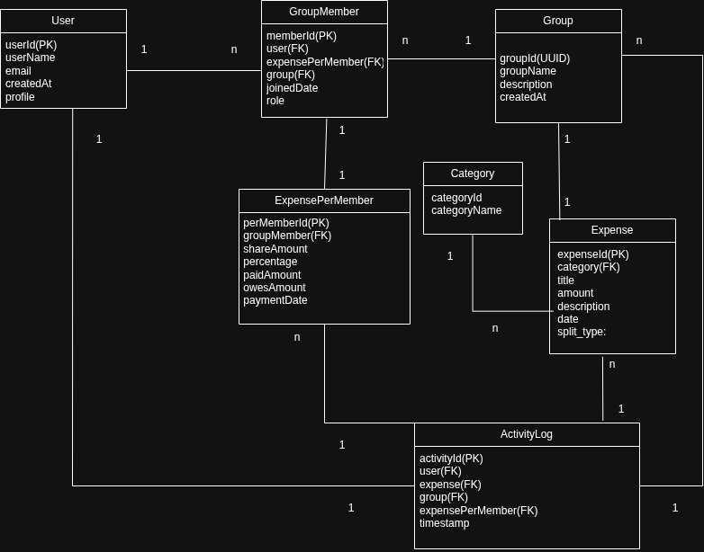
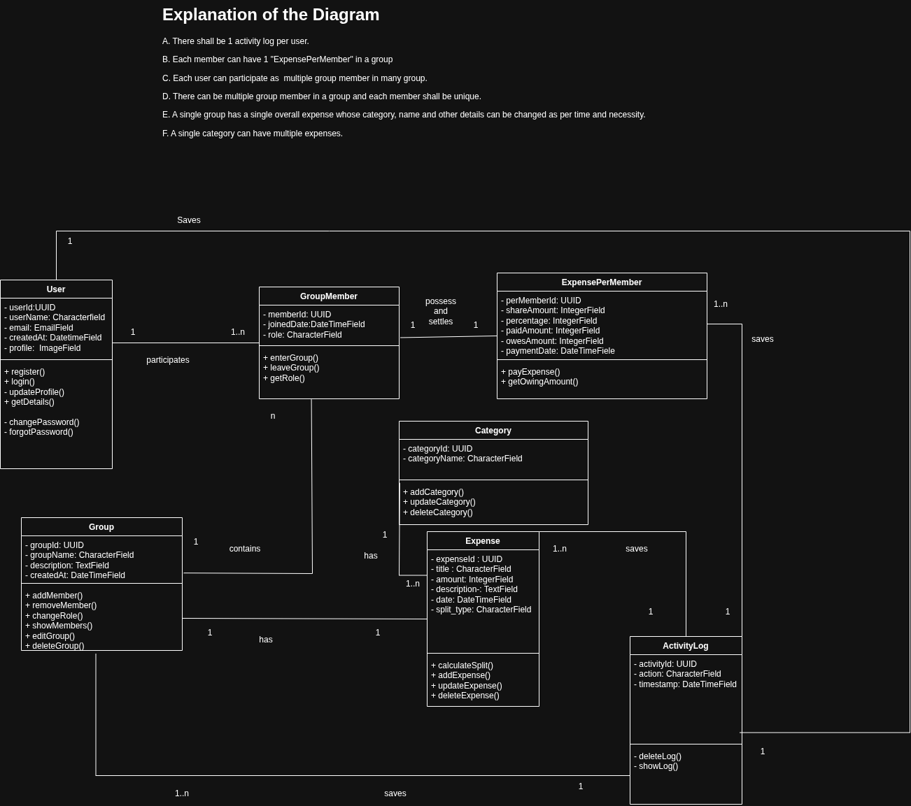
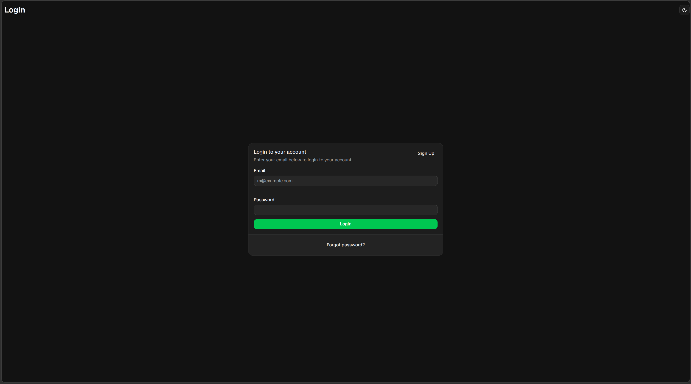
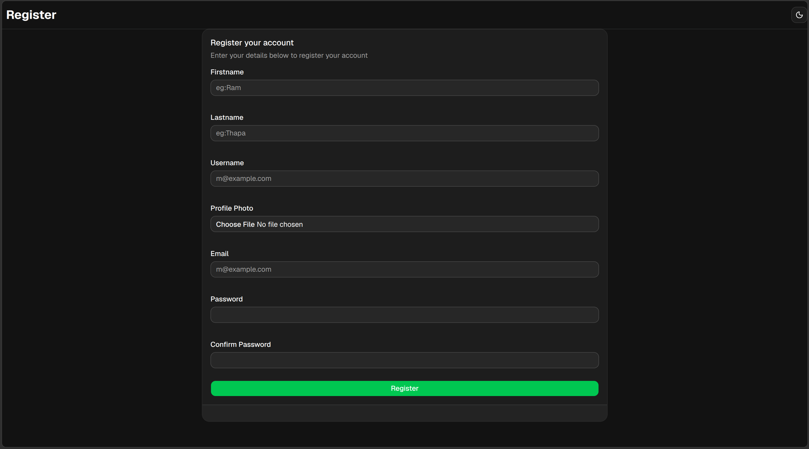
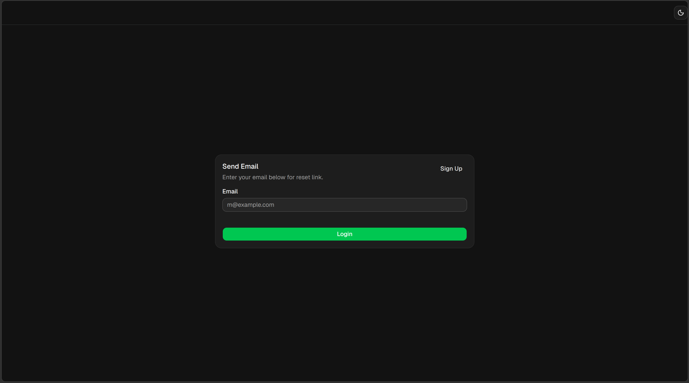
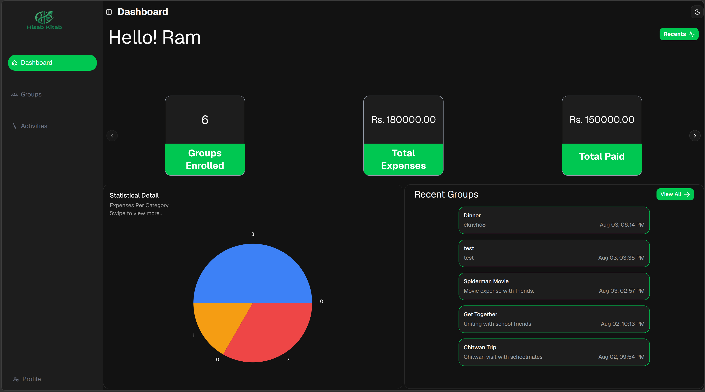
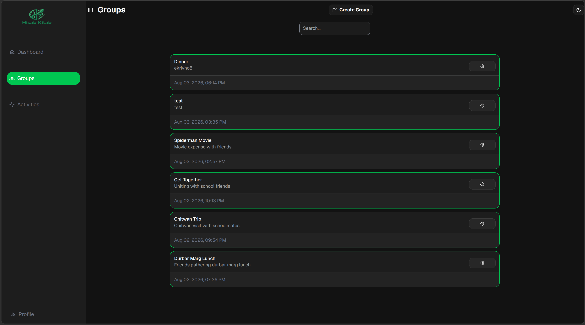
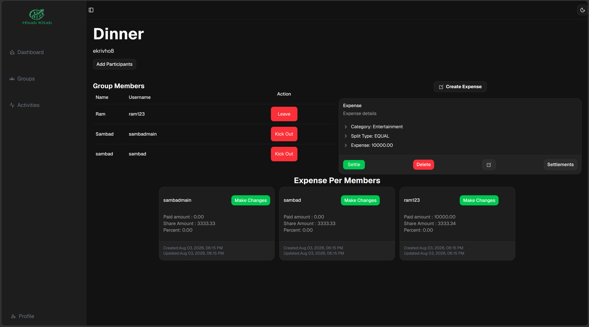
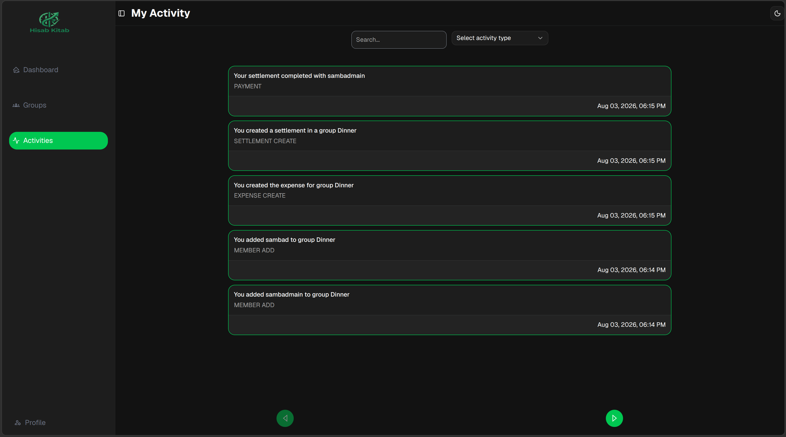
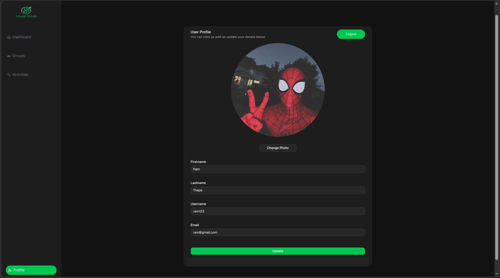

# Split — Expense Sharing & Group Settlement Platform

A full-stack expense management web application designed to simplify **group expense tracking, individual share management, and settlement calculation**.

Hisab Kitab allows users to create groups, record shared expenses, define how expenses are divided among members, track individual payments, and automatically determine who owes whom.

---

## Overview

**Hisab Kitab** is an expense-sharing application built with **Django REST Framework** for the backend and **React + TypeScript** for the frontend.

The application provides:

- User authentication
- Group management
- Shared expense management
- Equal, exact, and percentage-based splitting
- Individual payment and share tracking
- Automatic settlement calculation
- Activity/history tracking
- Dashboard analytics
- Search functionality
- Protected routes and API endpoints
- Client-side and server-side validation

The project was developed as a practical full-stack application to explore **REST API development, relational database design, authentication, financial calculations, state management, and modern frontend architecture**.

---

## Features

### Authentication

- User registration
- User login/logout
- JWT-based authentication
- HTTP-only cookie-based token handling
- Authentication state management
- Protected application routes
- Authentication guard endpoint
- Automatic handling of unauthorized requests

### Group Management

Users can:

- Create groups
- View their groups
- Search groups
- Add members
- Remove members
- View group details
- Manage group membership

Groups act as the primary container for shared expenses.

### Expense Management

Split supports multiple ways of dividing an expense.

#### Equal Split

The expense is divided equally among all group members.

```text
Total Expense = Rs. 10,000
Members       = 4

Each Member's Share = Rs. 2,500
```

#### Exact Amount Split

Each member can be assigned a specific amount.

```text
Member A → Rs. 4,000
Member B → Rs. 3,000
Member C → Rs. 2,000
Member D → Rs. 1,000
```

#### Percentage Split

Each member can specify their percentage contribution.

```text
Member A → 40%
Member B → 30%
Member C → 20%
Member D → 10%
```

The corresponding share is calculated automatically from the total expense.

### Payment Tracking

For each group member, Split tracks:

- Amount paid
- Amount owed/share
- Percentage contribution
- Net balance

The balance is calculated as:

```text
Balance = Amount Paid - Share Amount
```

Therefore:

- **Positive balance** → member should receive money
- **Negative balance** → member owes money
- **Zero balance** → member is settled

### Automatic Settlement

Split automatically calculates settlements between members.

The settlement algorithm uses a heap-based approach to match:

- Members who owe money
- Members who should receive money

**Example:**

```text
Alice   → +Rs. 2,000
Bob     → -Rs. 1,200
Charlie → -Rs. 800
```

Generated settlements:

```text
Bob     → Alice    Rs. 1,200
Charlie → Alice    Rs. 800
```

The settlement calculation is performed inside a database transaction to maintain consistency.

### Activity & History

The application maintains activity information for important actions, including:

- Group creation
- Member changes
- Expense-related actions
- Settlement-related actions

This provides users with a historical view of activity within the application.

### Dashboard

The dashboard provides an overview of the user's activity, including:

- Total groups
- Total expenses
- Expense/category statistics
- Settlement status
- Group information
- Visual analytics

### Search

Group search functionality allows users to quickly find relevant groups.

Search requests are debounced on the frontend to reduce unnecessary API requests.

---

## System Architecture

```text
┌─────────────────────────────┐
│          React UI           │
│      TypeScript + Vite      │
└──────────────┬──────────────┘
               │
               │ HTTP / REST API
               ▼
┌─────────────────────────────┐
│       Django REST API       │
│      Django REST Framework  │
└──────────────┬──────────────┘
               │
               ▼
┌─────────────────────────────┐
│        Service Layer        │
│ Expense / Settlement Logic  │
└──────────────┬──────────────┘
               │
               ▼
┌─────────────────────────────┐
│       PostgreSQL / DB       │
│        Relational Data      │
└─────────────────────────────┘
```

---

## Technology Stack

### Frontend

| Technology       | Purpose                       |
|-------------------|-------------------------------|
| React             | User interface                |
| TypeScript        | Type safety                   |
| Vite              | Development and build tooling |
| TanStack Router   | Client-side routing           |
| TanStack Query    | Server-state management       |
| Tailwind CSS      | Styling                       |
| shadcn/ui         | UI components                 |
| Zod               | Schema validation             |
| Axios             | HTTP requests                 |

### Backend

| Technology             | Purpose                |
|--------------------------|-------------------------|
| Python                  | Backend programming language |
| Django                  | Web framework           |
| Django REST Framework   | REST API                |
| Simple JWT              | JWT authentication       |
| Django ORM               | Database interaction     |
| PostgreSQL               | Relational database      |

### Development Tools

- Git
- GitHub
- Neovim
- Linux
- REST API testing tools

---

## Project Structure

```text
hisab_kitab/
│
├── Backend/
│   │
│   ├── <django-project>/
│   │   ├── settings.py
│   │   ├── urls.py
│   │   ├── wsgi.py
│   │   └── asgi.py
│   │
│   ├── <django-app>/
│   │   ├── models/
│   │   │   ├── __init__.py      
│   │   │   ├── group.py
│   │   │   ├── group_member.py
│   │   │   ├── expense.py
│   │   │   ├── expense_per_member.py
│   │   │   ├── settlement.py
│   │   │   └── activity.py
│   │   │
│   │   ├── serializers/
│   │   │   ├── __init__.py       
│   │   │   ├── group_serializer.py
│   │   │   ├── expense_serializer.py
│   │   │   ├── settlement_serializer.py
│   │   │   └── activity_serializer.py
│   │   │
│   │   ├── views/
│   │   │   ├── __init__.py      
│   │   │   ├── group_views.py
│   │   │   ├── expense_views.py
│   │   │   ├── settlement_views.py
│   │   │   └── activity_views.py
│   │   │
│   │   ├── urls/
│   │   │   ├── __init__.py      
│   │   │   ├── group_urls.py
│   │   │   ├── expense_urls.py
│   │   │   └── activity_urls.py
│   │   │
│   │   ├── services/
│   │   │   ├── __init__.py
│   │   │   ├── expense_service.py
│   │   │   └── settlement_service.py
│   │   │
│   │   ├── apps.py
│   │   ├── admin.py
│   │   └── tests/
│   │
│   ├── account/
│   │   ├── models/
│   │   ├── serializers/
│   │   ├── views/
│   │   ├── urls/
│   │   └── apps.py
│   │
│   ├── manage.py
│   └── requirements.txt
│
├── Frontend/
│   │
│   ├── src/
│   │   ├── components/
│   │   ├── routes/
│   │   ├── hooks/
│   │   ├── services/
│   │   ├── schemas/
│   │   ├── contexts/
│   │   └── types/
│   │
│   ├── package.json
│   ├── vite.config.ts
│   └── tsconfig.json
│
└── README.md
```

> Update the placeholder Django project/app names to match the actual repository structure.

---

## Database Design

The application follows a relational data model.

---

##  ER Diagram

<p align="center">
  
</p>

---

##  Class Diagram

<p align="center">
  
</p>

---
### Core Models

**User**
Represents an authenticated application user.

**Group**
Represents a collection of users sharing expenses.

**GroupMember**
Associates users with groups and represents a user's membership within a group.

**Expense**
Represents the shared expense associated with a group.

**ExpensePerMember**
Stores each member's:
- Payment
- Share
- Percentage

**Settlement**
Represents the transaction required between two members to settle an expense.

**Activity**
Stores historical actions performed within the application.

---

## Expense Calculation

For an expense:

```text
Total Expense = E
Number of Members = N
```

**Equal Split**
```text
Share = E / N
```

**Percentage Split**
```text
Share = (Percentage / 100) × E
```

**Member Balance**
```text
Balance = Paid Amount - Share Amount
```

The total balance across all members should satisfy:

```text
Σ Balance = 0
```

This invariant is important for correctly determining settlements.

---

## Settlement Algorithm

The settlement system separates members into two categories:

```text
Receivers
│
├── Members with positive balance
│
└── Should receive money


Payers
│
├── Members with negative balance
│
└── Should pay money
```

A heap-based algorithm is used to efficiently match outstanding balances.

Conceptually:

```text
while receivers and payers:

    receiver = largest positive balance
    payer = largest negative balance

    amount = min(
        receiver.balance,
        abs(payer.balance)
    )

    create settlement(payer → receiver)

    update both balances
```

The settlement calculation is performed inside a database transaction to maintain database consistency.

---

##  Authentication Flow

The application uses JWT authentication with tokens stored through cookies.

```text
User
 │
 │ Login
 ▼
Django API
 │
 │ Generate JWT
 ▼
HTTP-only Cookie
 │
 ▼
Authenticated Requests
 │
 ▼
Custom Authentication Class
 │
 ▼
Django REST Framework
```

The frontend maintains authentication state using an authentication context.

Protected routes are accessible only when the user is authenticated.

---

##  API Endpoints

The API is organized around application resources.

### Expense

| Method | Endpoint                                      | Description                     |
|--------|------------------------------------------------|----------------------------------|
| POST   | `/expense/create/<group_id>/`                  | Create an expense               |
| PATCH  | `/expense/updateexpenseper/<id>/`               | Update member expense information |
| POST   | `/expense/createsettlement/<id>/`               | Generate settlements            |
| GET    | `/expense/get-expense-per/<group_id>/`          | Get member expense information  |
| GET    | `/expense/getexpense/<group_id>/`               | Get group expense               |
| GET    | `/expense/get-settlement/<id>/`                 | Get settlements                 |

### Authentication

- `/account/register/`
- `/account/login/`
- `/account/logout/`
- `/isloggedin/`

### Groups

Group endpoints provide functionality for:

- Creating groups
- Listing groups
- Retrieving group details
- Adding members
- Removing members
- Searching groups

> Endpoint paths may vary depending on the current backend URL configuration.

---

##  Frontend Architecture

The frontend follows a component-based architecture.

```text
Pages / Routes
      │
      ▼
Reusable Components
      │
      ▼
Custom Hooks
      │
      ▼
TanStack Query
      │
      ▼
API Service Functions
      │
      ▼
Django REST API
```

For example:

```text
useFetchExpensePerMember()
        │
        ▼
TanStack Query
        │
        ▼
fetchExpensePerMember()
        │
        ▼
Axios
        │
        ▼
Django REST API
```

This separation keeps UI components independent from API implementation details.

---

##  Routing

The frontend uses TanStack Router for type-safe routing.

Example dynamic route:

```text
/groupdetail/$id
```

Dynamic route parameters are used to identify specific groups.

Search parameters are also supported for functionality such as group searching.

---

## Installation

### Prerequisites

Make sure the following are installed:

- Python 3.12+
- Node.js 18+
- npm
- PostgreSQL
- Git

### 1. Clone the Repository

```bash
git clone <repository-url>
cd Split
```

###  Backend Setup

Navigate to the backend directory:

```bash
cd Backend
```

Create a virtual environment:

```bash
python -m venv venv
```

Activate it on Linux/macOS:

```bash
source venv/bin/activate
```

On Windows:

```bash
venv\Scripts\activate
```

Install dependencies:

```bash
pip install -r requirements.txt
```

###  Environment Variables

Create a `.env` file in the backend project.

Example:

```env
DEBUG=True

SECRET_KEY=your-secret-key

DATABASE_NAME=your-database
DATABASE_USER=your-user
DATABASE_PASSWORD=your-password
DATABASE_HOST=localhost
DATABASE_PORT=5432
```

> Never commit sensitive environment variables to Git.

###  Database Setup

Run migrations:

```bash
python manage.py makemigrations
python manage.py migrate
```

Create a superuser if required:

```bash
python manage.py createsuperuser
```

Start the development server:

```bash
python manage.py runserver
```

The backend will normally be available at:

```text
http://127.0.0.1:8000/
```

### Frontend Setup

Open another terminal and navigate to the frontend:

```bash
cd Frontend
```

Install dependencies:

```bash
npm install
```

Create the required environment file:

```env
VITE_API_URL=http://127.0.0.1:8000
```

Start the development server:

```bash
npm run dev
```

The frontend will normally be available at:

```text
http://localhost:5173/
```

---

##  Testing

Backend tests can be executed using Django's test framework:

```bash
python manage.py test
```

Frontend linting:

```bash
npm run lint
```

Build the frontend:

```bash
npm run build
```

---
---

# Screenshots

##  Authentication

### Login

<p align="center">
  
</p>

### Register

<p align="center">
  
</p>

### Forgot Password

<p align="center">
  
</p>

---

##  Dashboard

<p align="center">
  
</p>

---

##  Groups

<p align="center">
  
</p>

---

##  Group Details

<p align="center">
  
</p>

---

##  Activities

<p align="center">
  
</p>

---

##  Profile

<p align="center">
  
</p>

---

#  Project Status

**Status:** Active Development

Hisab Kitab is continuously being improved with additional features, UI refinements, backend optimizations, and testing.

---

#  Author

**Sambad Khatiwada**
Full-Stack Developer

---
---
## Contact
- Email: sambadkhatiwada939@gmail.com
- Linkedin:https://www.linkedin.com/in/sambad-khatiwada/
- Github: https://github.com/sambad-K/
---

#  Acknowledgements

This project was inspired by the general concept of group expense-sharing applications such as Splitwise and was developed as a practical full-stack software engineering project.

---

#  Project Philosophy

> **Make shared expenses simple, transparent, and easy to settle.**

Hisab Kitab combines a modern React frontend with a structured Django REST backend to demonstrate how a real-world expense-sharing system can be designed and implemented from the ground up.